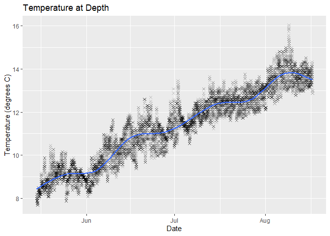
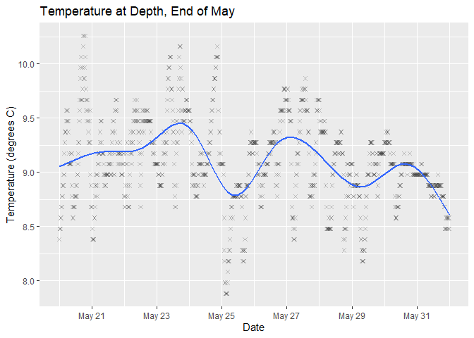
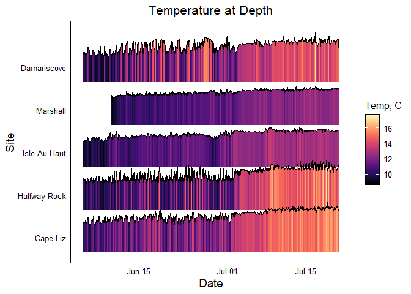
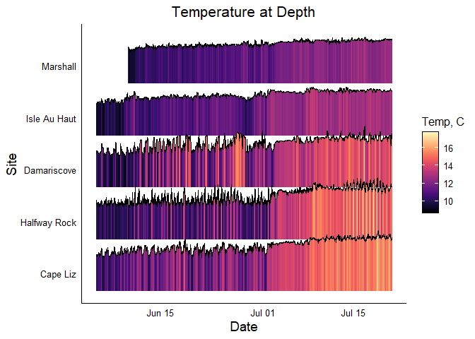
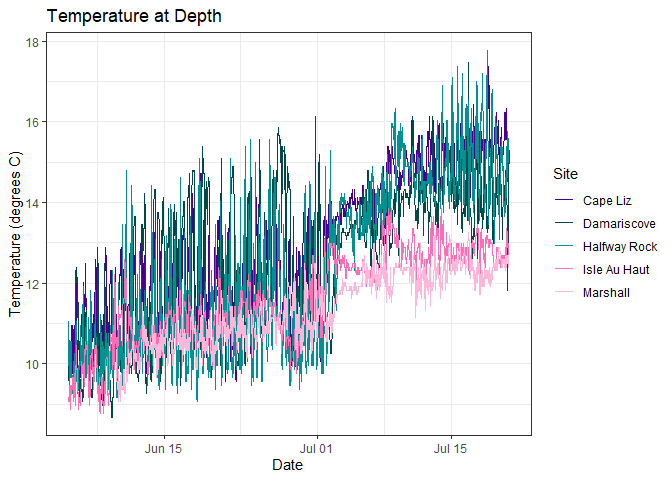
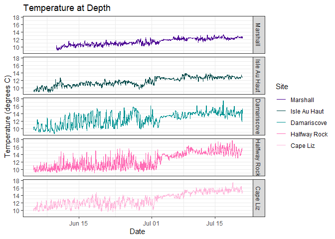
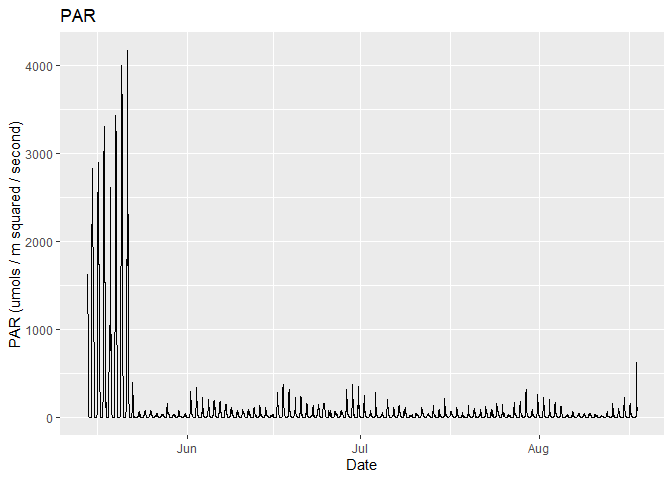
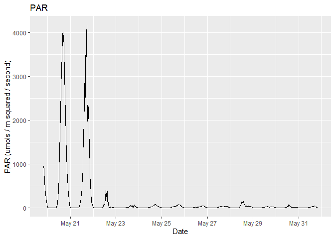

sensible
================

## Requirements

- [R v4+](https://www.r-project.org/)
- [dplyr](https://CRAN.R-project.org/package=dplyr)
- [readr](https://CRAN.R-project.org/package=readr)
- [stringr](https://CRAN.R-project.org/package=stringr)
- [ggplot2](https://CRAN.R-project.org/package=ggplot2)
- [lubridate](https://CRAN.R-project.org/package=lubridate)
- [clifro](https://CRAN.R-project.org/package=clifro)
- [lubridate](https://CRAN.R-project.org/package=lubridate)
- [oceanwaves](https://CRAN.R-project.org/package=oceanwaves)
- [oce](https://CRAN.R-project.org/package=oce)
- [owhlR](https://github.com/millerlp/owhlR) *from github*
- [mesowest](https://github.com/fickse/mesowest) *from github*

## Installation

    remotes::install_github("rfrancolini/sensible")

## Temperature Data

There are a handful of functions for managing and understanding your
HOBO temperature data. This will work on any HOBO data that has been
downloaded in csv format (not hproj format).

## Function: read_hobotemp()

This function will take in raw hobotemp data and output a csv. Options
include whether you want to define a site name (if not, itll pull it
from the file name), if you want to define the start/stop times, have it
automatically remove the first and last day (default setting), or keep
all of the data, and if you want to write a file with a specific output
name.

### Read Example Data

``` r
library(sensible)
x <- read_hobotemp()
x
```

    ## # A tibble: 9,025 × 5
    ##    Reading DateTime             Temp Intensity Site        
    ##      <int> <dttm>              <dbl>     <dbl> <chr>       
    ##  1      53 2021-05-15 00:04:32  8.18         0 LittleDrisko
    ##  2      54 2021-05-15 00:19:32  8.18         0 LittleDrisko
    ##  3      55 2021-05-15 00:34:32  8.08         0 LittleDrisko
    ##  4      56 2021-05-15 00:49:32  8.18         0 LittleDrisko
    ##  5      57 2021-05-15 01:04:32  8.08         0 LittleDrisko
    ##  6      58 2021-05-15 01:19:32  8.08         0 LittleDrisko
    ##  7      59 2021-05-15 01:34:32  7.98         0 LittleDrisko
    ##  8      60 2021-05-15 01:49:32  7.88         0 LittleDrisko
    ##  9      61 2021-05-15 02:04:32  7.88         0 LittleDrisko
    ## 10      62 2021-05-15 02:19:32  7.88         0 LittleDrisko
    ## # ℹ 9,015 more rows

### Read Example Data with User Defined Site

``` r
library(sensible)
x <- read_hobotemp(site = "Little Drisko Island")
x
```

    ## # A tibble: 9,025 × 5
    ##    Reading DateTime             Temp Intensity Site                
    ##      <int> <dttm>              <dbl>     <dbl> <chr>               
    ##  1      53 2021-05-15 00:04:32  8.18         0 Little Drisko Island
    ##  2      54 2021-05-15 00:19:32  8.18         0 Little Drisko Island
    ##  3      55 2021-05-15 00:34:32  8.08         0 Little Drisko Island
    ##  4      56 2021-05-15 00:49:32  8.18         0 Little Drisko Island
    ##  5      57 2021-05-15 01:04:32  8.08         0 Little Drisko Island
    ##  6      58 2021-05-15 01:19:32  8.08         0 Little Drisko Island
    ##  7      59 2021-05-15 01:34:32  7.98         0 Little Drisko Island
    ##  8      60 2021-05-15 01:49:32  7.88         0 Little Drisko Island
    ##  9      61 2021-05-15 02:04:32  7.88         0 Little Drisko Island
    ## 10      62 2021-05-15 02:19:32  7.88         0 Little Drisko Island
    ## # ℹ 9,015 more rows

### Read Example Data With User Defined Start/Stop Dates

``` r
ss <- as.POSIXct(c("2021-05-20", "2021-06-01"), tz = "UTC")
xud <- read_hobotemp(clipped = "user", startstop = ss)
xud
```

    ## # A tibble: 1,152 × 5
    ##    Reading DateTime             Temp Intensity Site        
    ##      <int> <dttm>              <dbl>     <dbl> <chr>       
    ##  1     533 2021-05-20 00:04:32  8.38         0 LittleDrisko
    ##  2     534 2021-05-20 00:19:32  8.48         0 LittleDrisko
    ##  3     535 2021-05-20 00:34:32  8.48         0 LittleDrisko
    ##  4     536 2021-05-20 00:49:32  8.48         0 LittleDrisko
    ##  5     537 2021-05-20 01:04:32  8.58         0 LittleDrisko
    ##  6     538 2021-05-20 01:19:32  8.58         0 LittleDrisko
    ##  7     539 2021-05-20 01:34:32  8.68         0 LittleDrisko
    ##  8     540 2021-05-20 01:49:32  8.68         0 LittleDrisko
    ##  9     541 2021-05-20 02:04:32  8.78         0 LittleDrisko
    ## 10     542 2021-05-20 02:19:32  8.78         0 LittleDrisko
    ## # ℹ 1,142 more rows

## Function: summarize_hobotemp()

Create a dataframe summarizing the temperature data, will group by site.

### Summarize data, csv with one site

``` r
sum1 <- summarize_hobotemp(x)
print.data.frame(sum1)
```

    ##                   Site mean.temp           first.day            last.day
    ## 1 Little Drisko Island  11.30466 2021-05-15 00:04:32 2021-08-17 00:04:32
    ##   max.temp       max.temp.date min.temp       min.temp.date
    ## 1   16.046 2021-08-08 22:34:32    7.682 2021-05-15 07:34:32

### Summarize data, csv with more than one site

``` r
sum2 <- summarize_hobotemp(example_ridge_data())
```

    ## Rows: 26018 Columns: 5
    ## ── Column specification ────────────────────────────────────────────────────────
    ## Delimiter: ","
    ## chr  (1): Site
    ## dbl  (3): Reading, Temp, Intensity
    ## dttm (1): DateTime
    ## 
    ## ℹ Use `spec()` to retrieve the full column specification for this data.
    ## ℹ Specify the column types or set `show_col_types = FALSE` to quiet this message.

``` r
print.data.frame(sum2)
```

    ##           Site mean.temp           first.day            last.day max.temp
    ## 1     Cape Liz  12.95992 2021-06-05 00:11:44 2021-07-20 23:56:44   17.379
    ## 2  Damariscove  12.58830 2021-06-05 00:04:55 2021-07-20 23:49:55   17.475
    ## 3 Halfway Rock  12.35469 2021-06-05 00:14:09 2021-07-20 23:59:09   17.760
    ## 4 Isle Au Haut  11.61809 2021-06-05 00:00:00 2021-07-21 00:00:00   13.846
    ## 5     Marshall  11.38961 2021-06-10 00:00:00 2021-07-21 00:00:00   13.269
    ##         max.temp.date min.temp       min.temp.date
    ## 1 2021-07-18 20:41:44    9.571 2021-06-21 09:56:44
    ## 2 2021-07-16 19:04:55    8.680 2021-06-09 12:49:55
    ## 3 2021-07-18 18:14:09    9.077 2021-06-18 09:59:09
    ## 4 2021-07-08 10:00:00    8.779 2021-06-08 07:00:00
    ## 5 2021-07-16 18:45:00    9.077 2021-06-10 05:15:00

## Function: draw_temp_scatter_plot()

This function will read in a csv of your HOBO data and draw a scatter
plot with an overlapping trendline.

### Draw Example Scatter Plot

``` r
tempplot_x <- draw_temp_scatter_plot(x)
tempplot_x
```

<!-- -->

### Draw Example Scatter Plot with User Defined Start/Stop Dates and Title

``` r
tempplot_xud <- draw_temp_scatter_plot(xud, main = "Temperature at Depth, End of May")
tempplot_xud
```

<!-- -->

## Function: draw_ridgeline_plot()

This function will create a color-coded ridgeline plot, adapted from
[here](https://r-graph-gallery.com/294-basic-ridgeline-plot.html). This
will have a line representing the temperature, as well as the space
underneath the line colored in using a temperature gradient color
scheme. Sites will appear in order they are in dataframe, unless
“ordered” option is used.

### Draw example ridgeline plot

``` r
ridgelineplot <- draw_ridgeline_plot()
ridgelineplot
```

<!-- -->

### Draw example ridgeline plot with specified site order (south to north)

``` r
SiteOrder <-  c("Cape Liz", "Halfway Rock", "Damariscove", "Isle Au Haut", "Marshall")
ridgelineplotO <- draw_ridgeline_plot(ordered = SiteOrder)
ridgelineplotO
```

<!-- -->

## Function: draw_temp_line_plot()

This function will create a line plot, with a colorblind friendly color
pallette, and can currently take up to 15 sites at once. Sites will
appear in legend (or will be facetted upon) in order they are in
dataframe, unless “ordered” option is used.

### Draw example line plot

``` r
lineplot <- draw_temp_line_plot()
lineplot
```

<!-- -->

### Draw example line plot facetted with specified site order (south to north)

``` r
SiteOrder <-  c("Cape Liz", "Halfway Rock", "Damariscove", "Isle Au Haut", "Marshall")
lineplotO <- draw_temp_line_plot(ordered = SiteOrder, facet = "Site")
lineplotO
```

<!-- -->

## Tilt-Current Meter Data

There are a handful of functions for managing and understanding your
tilt-current meter data.

## Read Example Data

``` r
library(sensible)
x <- read_tiltometer()
x
```

    ## # A tibble: 67,681 × 5
    ##    DateTime            speed   dir     v     u
    ##    <dttm>              <dbl> <dbl> <dbl> <dbl>
    ##  1 2021-05-15 00:00:00  0.95  319   0.71 -0.62
    ##  2 2021-05-15 00:02:00  1.24  321.  0.96 -0.79
    ##  3 2021-05-15 00:04:00  0.88  315.  0.63 -0.63
    ##  4 2021-05-15 00:06:00  1.01  327.  0.84 -0.55
    ##  5 2021-05-15 00:08:00  1.11  300.  0.55 -0.96
    ##  6 2021-05-15 00:10:00  1.31  326.  1.09 -0.72
    ##  7 2021-05-15 00:12:00  1.8   339.  1.68 -0.65
    ##  8 2021-05-15 00:14:00  0.93  323.  0.74 -0.57
    ##  9 2021-05-15 00:16:00  0.72  351.  0.71 -0.11
    ## 10 2021-05-15 00:18:00  1.43  325.  1.17 -0.82
    ## # ℹ 67,671 more rows

``` r
#uv <- draw_uv(x)
#uv
```

``` r
#month <- droplevels(factor(format(x$date, "%b"), levels = month.abb))
#tiltometer_rose(x, facet = month, n_col = 2, speed.cuts = "quantile-4")
```

## Wave Logger Data

There are a handful of functions for managing and understanding your
open wave height logger data.

## Read Example Data

``` r
library(sensible)
x <- read_wavelogger()
head(x)
```

    ## # A tibble: 6 × 3
    ##   DateTime            Pressure.mbar TempC
    ##   <dttm>                      <dbl> <dbl>
    ## 1 2021-05-16 00:00:00         1556.  7.91
    ## 2 2021-05-16 00:00:00         1556.  7.9 
    ## 3 2021-05-16 00:00:00         1556.  7.89
    ## 4 2021-05-16 00:00:00         1556   7.89
    ## 5 2021-05-16 00:00:01         1556   7.89
    ## 6 2021-05-16 00:00:01         1556.  7.89

## Read Air Pressure Data Example

``` r
a <- example_airpressure()
head(a)
```

    ##   DateTime sea_pressure.mbar
    ## 1     <NA>           1022.05
    ## 2     <NA>           1022.05
    ## 3     <NA>           1022.05
    ## 4     <NA>           1022.05
    ## 5     <NA>           1022.06
    ## 6     <NA>           1022.06

## Calculate Wave Statistcs

``` r
#i <- interp_swpressure(wavelogger = x, airpressure = a)

#w <- wave_stats(wavelogger = mbar_to_elevation(wavelogger = i)) 

#head(w)
```

## Graph Significant Wave Height

``` r
#wave_plot <- wavespec_plot(w)
#wave_plot
```

## PAR data

This is for managing and understanding your PAR Odyssey Xtreem data

## Read Example Data

``` r
library(sensible)
x <- read_parXtreem()
x
```

    ## # A tibble: 9,121 × 5
    ##     Temp   PAR ID           logDateTime DateTime           
    ##    <dbl> <dbl> <chr>              <dbl> <dttm>             
    ##  1  7.19 1622. FE23BC74DC01  1621022400 2021-05-14 20:00:00
    ##  2  7.13  739. FE23BC74DC01  1621023300 2021-05-14 20:15:00
    ##  3  7.13  206. FE23BC74DC01  1621024200 2021-05-14 20:30:00
    ##  4  7.19  957. FE23BC74DC01  1621025100 2021-05-14 20:45:00
    ##  5  7.19  443. FE23BC74DC01  1621026000 2021-05-14 21:00:00
    ##  6  7.25  635. FE23BC74DC01  1621026900 2021-05-14 21:15:00
    ##  7  7.25  834. FE23BC74DC01  1621027800 2021-05-14 21:30:00
    ##  8  7.38  695. FE23BC74DC01  1621028700 2021-05-14 21:45:00
    ##  9  7.44  433. FE23BC74DC01  1621029600 2021-05-14 22:00:00
    ## 10  7.5   364. FE23BC74DC01  1621030500 2021-05-14 22:15:00
    ## # ℹ 9,111 more rows

## Draw Example Plot

``` r
parplot_x <- draw_par_plot(x)
parplot_x
```

<!-- -->

## Read Example Data with Defined Start/Stop Dates

``` r
ss <- as.POSIXct(c("2021-05-20", "2021-06-01"), tz = "UTC")
xud <- read_parXtreem(clipped = "user", startstop = ss)
xud
```

    ## # A tibble: 1,153 × 5
    ##     Temp   PAR ID           logDateTime DateTime           
    ##    <dbl> <dbl> <chr>              <dbl> <dttm>             
    ##  1  9.5   955. FE23BC74DC01  1621454400 2021-05-19 20:00:00
    ##  2  9.38  873. FE23BC74DC01  1621455300 2021-05-19 20:15:00
    ##  3  9.31  765. FE23BC74DC01  1621456200 2021-05-19 20:30:00
    ##  4  9.31  666. FE23BC74DC01  1621457100 2021-05-19 20:45:00
    ##  5  8.75  566. FE23BC74DC01  1621458000 2021-05-19 21:00:00
    ##  6  8.31  473  FE23BC74DC01  1621458900 2021-05-19 21:15:00
    ##  7  8     412. FE23BC74DC01  1621459800 2021-05-19 21:30:00
    ##  8  7.81  356. FE23BC74DC01  1621460700 2021-05-19 21:45:00
    ##  9  7.81  297. FE23BC74DC01  1621461600 2021-05-19 22:00:00
    ## 10  7.81  246. FE23BC74DC01  1621462500 2021-05-19 22:15:00
    ## # ℹ 1,143 more rows

## Draw Example Plot User Defined Start/Stop Dates

``` r
parplot_xud <- draw_par_plot(xud)
parplot_xud
```

<!-- -->

## Read Example Data Without Clipping Data

``` r
xna <- read_parXtreem(clipped = "none")
xna
```

    ## # A tibble: 9,166 × 5
    ##     Temp   PAR ID           logDateTime DateTime           
    ##    <dbl> <dbl> <chr>              <dbl> <dttm>             
    ##  1  19.6  20.5 FE23BC74DC01  1620990900 2021-05-14 11:15:00
    ##  2  19.9  81.8 FE23BC74DC01  1620991800 2021-05-14 11:30:00
    ##  3  19.9  79.4 FE23BC74DC01  1620992700 2021-05-14 11:45:00
    ##  4  16.4 535.  FE23BC74DC01  1620993600 2021-05-14 12:00:00
    ##  5  13.1   0   FE23BC74DC01  1620994500 2021-05-14 12:15:00
    ##  6  12    81.4 FE23BC74DC01  1620995400 2021-05-14 12:30:00
    ##  7  13.4  22.7 FE23BC74DC01  1620996300 2021-05-14 12:45:00
    ##  8  13.4  63.6 FE23BC74DC01  1620997200 2021-05-14 13:00:00
    ##  9  13.1  46.9 FE23BC74DC01  1620998100 2021-05-14 13:15:00
    ## 10  13.4  37.8 FE23BC74DC01  1620999000 2021-05-14 13:30:00
    ## # ℹ 9,156 more rows

## Draw Example Plot Without Clipping Data

``` r
parplot_na <- draw_par_plot(xna)
parplot_na
```

<!-- -->
