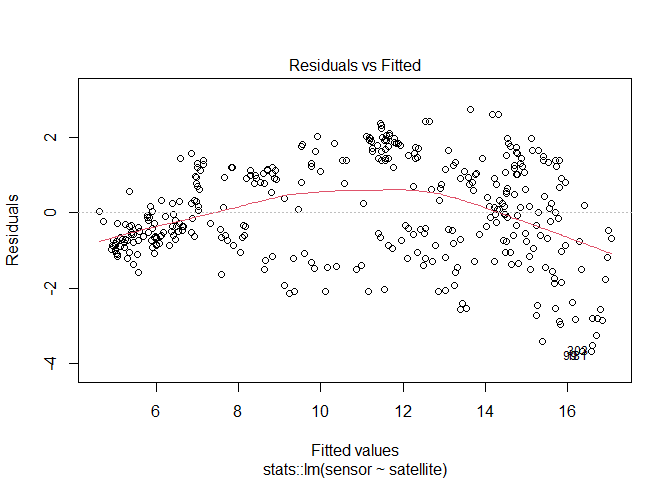
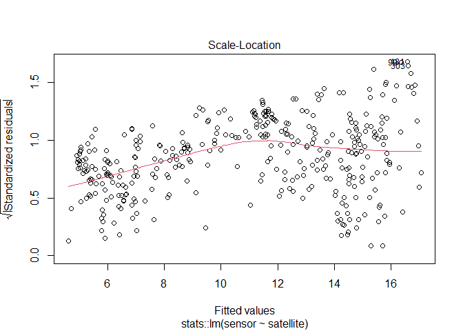
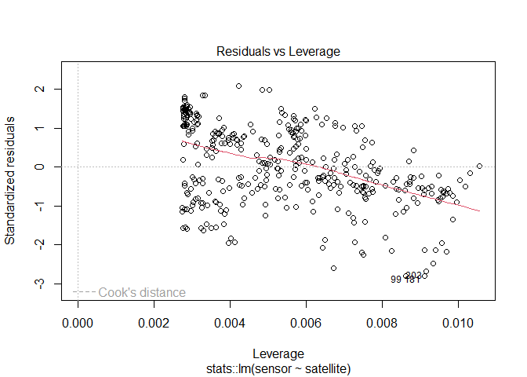
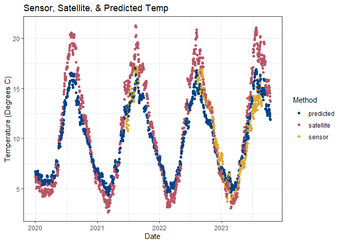

sensible
================

## Requirements

- [R v4+](https://www.r-project.org/)
- [dplyr](https://CRAN.R-project.org/package=dplyr)
- [readr](https://CRAN.R-project.org/package=readr)
- [stringr](https://CRAN.R-project.org/package=stringr)
- [ggplot2](https://CRAN.R-project.org/package=ggplot2)
- [lubridate](https://CRAN.R-project.org/package=lubridate)
- [clifro](https://CRAN.R-project.org/package=clifro)
- [lubridate](https://CRAN.R-project.org/package=lubridate)
- [oceanwaves](https://CRAN.R-project.org/package=oceanwaves)
- [oce](https://CRAN.R-project.org/package=oce)
- [owhlR](https://github.com/millerlp/owhlR) *from github*
- [mesowest](https://github.com/fickse/mesowest) *from github*

## Installation

    remotes::install_github("rfrancolini/sensible")

# About Sensible

This package is built to aid in the processing and summarizing of
various environmental sensors. Initially created to streamline the
QA/QC-ing of the following sensors - (1) Onset’s HOBO Temperature
Logger, (2) Lowell Instrument’s Tilt Current Meter, (3) Dataflow
Systems’ Odyssey Xtreem PAR Logger, and (4) the Open Wave Height
Logger - the functions can be used on any sensors that have similar data
structure. All of the previously mentioned sensors often have their own
programs that pre-process data and output them in a csv format. However,
one detail that the sensor-specific program may not process is when the
sensor was turned on to start recording versus when the sensor was
deployed. This package allows the user to define what time points they
want to analyze the data for, eliminating noise at the start and stop of
the data files.

This package also has multiple plotting functions to aid in the
visualization of the data. Scatter plots with smoothed lines are
included for most sensors. Additionally, the temperature data can also
be plotted as a ridgeline plot, and the tilt current meter data can be
plotted as a wind rose diagram as a more dynamic way to visualize these
data. Even if data has not been processed with the read\_…() functions,
plotting functions can be used as long as they are structured the same
way as the output of the read\_…() functions.

In addition to processing and summarizing the data gathered via the
sensors, this package has functions that will generate a linear model
using the sensor data and corresponding satellite data. In carrying out
our research using our sensors deployed at each site, we realized that
while the sensors were providing us a more precise at-depth measurement
at our specific sites than satellite data may provide (due to the
coarse-grain nature of satellite data), we were lacking many days of
data due to having to remove the sensors in the winter months,
malfunctioning sensors, or batteries expiring partway through
deployment. Instead of scrapping the sensor data we had in hand, we
opted to create a model correlating satellite data for a specific site
and the data gathered from the sensor deployed at this site. With the
generated model, we were then able to predict what the sensor would have
registered on the days where it was not in the water. This way, we were
able to still use site-specific “at-depth” measurements, and have
year-round data to implement in downstream applications.

## Temperature Data (Onset HOBO Temperature Loggers)

This is to be used after initial downloading of data onto a computer
using the HOBOware program.

### Function: read_hobotemp()

This will function on any HOBO data that has been downloaded in csv
format (not hproj format), or temperature data that has the same initial
format as HOBO temperature logger data, and output a csv. Options
include (1) whether you want to define a site name (if not, it will pull
it from the file name), (2) if you want to define the start/stop times,
have it automatically remove the first and last day (default setting),
or keep all of the data, and (3) if you want to write a file with a
specific output name.

#### Read Example Data

``` r
library(sensible)
x <- read_hobotemp()
x
```

    ## # A tibble: 9,025 × 5
    ##    Reading DateTime             Temp Intensity Site        
    ##      <int> <dttm>              <dbl>     <dbl> <chr>       
    ##  1      53 2021-05-15 00:04:32  8.18         0 LittleDrisko
    ##  2      54 2021-05-15 00:19:32  8.18         0 LittleDrisko
    ##  3      55 2021-05-15 00:34:32  8.08         0 LittleDrisko
    ##  4      56 2021-05-15 00:49:32  8.18         0 LittleDrisko
    ##  5      57 2021-05-15 01:04:32  8.08         0 LittleDrisko
    ##  6      58 2021-05-15 01:19:32  8.08         0 LittleDrisko
    ##  7      59 2021-05-15 01:34:32  7.98         0 LittleDrisko
    ##  8      60 2021-05-15 01:49:32  7.88         0 LittleDrisko
    ##  9      61 2021-05-15 02:04:32  7.88         0 LittleDrisko
    ## 10      62 2021-05-15 02:19:32  7.88         0 LittleDrisko
    ## # ℹ 9,015 more rows

#### Read Example Data with User Defined Site

``` r
library(sensible)
x <- read_hobotemp(site = "Little Drisko Island")
x
```

    ## # A tibble: 9,025 × 5
    ##    Reading DateTime             Temp Intensity Site                
    ##      <int> <dttm>              <dbl>     <dbl> <chr>               
    ##  1      53 2021-05-15 00:04:32  8.18         0 Little Drisko Island
    ##  2      54 2021-05-15 00:19:32  8.18         0 Little Drisko Island
    ##  3      55 2021-05-15 00:34:32  8.08         0 Little Drisko Island
    ##  4      56 2021-05-15 00:49:32  8.18         0 Little Drisko Island
    ##  5      57 2021-05-15 01:04:32  8.08         0 Little Drisko Island
    ##  6      58 2021-05-15 01:19:32  8.08         0 Little Drisko Island
    ##  7      59 2021-05-15 01:34:32  7.98         0 Little Drisko Island
    ##  8      60 2021-05-15 01:49:32  7.88         0 Little Drisko Island
    ##  9      61 2021-05-15 02:04:32  7.88         0 Little Drisko Island
    ## 10      62 2021-05-15 02:19:32  7.88         0 Little Drisko Island
    ## # ℹ 9,015 more rows

#### Read Example Data With User Defined Start/Stop Dates

``` r
ss <- as.POSIXct(c("2021-05-20", "2021-06-01"), tz = "UTC")
xud <- read_hobotemp(clipped = "user", startstop = ss)
xud
```

    ## # A tibble: 1,152 × 5
    ##    Reading DateTime             Temp Intensity Site        
    ##      <int> <dttm>              <dbl>     <dbl> <chr>       
    ##  1     533 2021-05-20 00:04:32  8.38         0 LittleDrisko
    ##  2     534 2021-05-20 00:19:32  8.48         0 LittleDrisko
    ##  3     535 2021-05-20 00:34:32  8.48         0 LittleDrisko
    ##  4     536 2021-05-20 00:49:32  8.48         0 LittleDrisko
    ##  5     537 2021-05-20 01:04:32  8.58         0 LittleDrisko
    ##  6     538 2021-05-20 01:19:32  8.58         0 LittleDrisko
    ##  7     539 2021-05-20 01:34:32  8.68         0 LittleDrisko
    ##  8     540 2021-05-20 01:49:32  8.68         0 LittleDrisko
    ##  9     541 2021-05-20 02:04:32  8.78         0 LittleDrisko
    ## 10     542 2021-05-20 02:19:32  8.78         0 LittleDrisko
    ## # ℹ 1,142 more rows

### Function: summarize_hobotemp()

Create a dataframe summarizing the temperature data, will group by site.

#### Summarize data, csv with one site

``` r
sum1 <- summarize_hobotemp(x)
print.data.frame(sum1)
```

    ##                   Site mean.temp           first.day            last.day
    ## 1 Little Drisko Island  11.30466 2021-05-15 00:04:32 2021-08-17 00:04:32
    ##   max.temp       max.temp.date min.temp       min.temp.date
    ## 1   16.046 2021-08-08 22:34:32    7.682 2021-05-15 07:34:32

#### Summarize data, csv with more than one site

``` r
sum2 <- summarize_hobotemp(example_ridge_data())
```

    ## Rows: 26018 Columns: 5
    ## ── Column specification ────────────────────────────────────────────────────────
    ## Delimiter: ","
    ## chr  (1): Site
    ## dbl  (3): Reading, Temp, Intensity
    ## dttm (1): DateTime
    ## 
    ## ℹ Use `spec()` to retrieve the full column specification for this data.
    ## ℹ Specify the column types or set `show_col_types = FALSE` to quiet this message.

``` r
print.data.frame(sum2)
```

    ##           Site mean.temp           first.day            last.day max.temp
    ## 1     Cape Liz  12.95992 2021-06-05 00:11:44 2021-07-20 23:56:44   17.379
    ## 2  Damariscove  12.58830 2021-06-05 00:04:55 2021-07-20 23:49:55   17.475
    ## 3 Halfway Rock  12.35469 2021-06-05 00:14:09 2021-07-20 23:59:09   17.760
    ## 4 Isle Au Haut  11.61809 2021-06-05 00:00:00 2021-07-21 00:00:00   13.846
    ## 5     Marshall  11.38961 2021-06-10 00:00:00 2021-07-21 00:00:00   13.269
    ##         max.temp.date min.temp       min.temp.date
    ## 1 2021-07-18 20:41:44    9.571 2021-06-21 09:56:44
    ## 2 2021-07-16 19:04:55    8.680 2021-06-09 12:49:55
    ## 3 2021-07-18 18:14:09    9.077 2021-06-18 09:59:09
    ## 4 2021-07-08 10:00:00    8.779 2021-06-08 07:00:00
    ## 5 2021-07-16 18:45:00    9.077 2021-06-10 05:15:00

### Function: draw_temp_scatter_plot()

This function will read in a csv of your HOBO data and draw a scatter
plot with an overlapping trendline.

#### Draw Example Scatter Plot

``` r
tempplot_x <- draw_temp_scatter_plot(x)
tempplot_x
```

<!-- -->

#### Draw Example Scatter Plot with User Defined Start/Stop Dates and Title

``` r
tempplot_xud <- draw_temp_scatter_plot(xud, main = "Temperature at Depth, End of May")
tempplot_xud
```

<!-- -->

### Function: draw_ridgeline_plot()

This function will create a color-coded ridgeline plot, adapted from
[here](https://r-graph-gallery.com/294-basic-ridgeline-plot.html). This
will have a line representing the temperature, as well as the space
underneath the line colored in using a temperature gradient color
scheme. Sites will appear in order they are in dataframe, unless
“ordered” option is used.

#### Draw example ridgeline plot

``` r
ridgelineplot <- draw_ridgeline_plot()
ridgelineplot
```

<!-- -->

#### Draw example ridgeline plot with specified site order (south to north)

``` r
SiteOrder <-  c("Cape Liz", "Halfway Rock", "Damariscove", "Isle Au Haut", "Marshall")
ridgelineplotO <- draw_ridgeline_plot(ordered = SiteOrder)
ridgelineplotO
```

<!-- -->

### Function: draw_temp_line_plot()

This function will create a line plot, with a colorblind friendly color
pallette, and can currently take up to 15 sites at once. Sites will
appear in legend (or will be facetted upon) in order they are in
dataframe, unless “ordered” option is used.

#### Draw example line plot

``` r
lineplot <- draw_temp_line_plot()
lineplot
```

<!-- -->

#### Draw example line plot facetted with specified site order (south to north)

``` r
SiteOrder <-  c("Cape Liz", "Halfway Rock", "Damariscove", "Isle Au Haut", "Marshall")
lineplotO <- draw_temp_line_plot(ordered = SiteOrder, facet = "Site")
lineplotO
```

<!-- -->

## Tilt-Current Meter Data (Lowell Instruments Tilt-Current Meter)

This is to be used after initial downloading of data onto a computer
using the Domino program.

### Function: read_tiltometer()

This function will take in raw tilt current meter data and output a csv.
Options include (1) whether you want to define a site name (if not, it
will pull it from the file name), (2) if you want to define the
start/stop times, have it automatically remove the first and last day
(default setting), or keep all of the data, and (3) if you want to write
a file with a specific output name. Example for the basic function is
below, to see examples implementing defined start/stop times or specific
sites, see read_hobotemp() documentation above.

#### Read Example Data

``` r
library(sensible)
x <- read_tiltometer()
x
```

    ## # A tibble: 67,681 × 5
    ##    DateTime            speed   dir     v     u
    ##    <dttm>              <dbl> <dbl> <dbl> <dbl>
    ##  1 2021-05-15 00:00:00  0.95  319   0.71 -0.62
    ##  2 2021-05-15 00:02:00  1.24  321.  0.96 -0.79
    ##  3 2021-05-15 00:04:00  0.88  315.  0.63 -0.63
    ##  4 2021-05-15 00:06:00  1.01  327.  0.84 -0.55
    ##  5 2021-05-15 00:08:00  1.11  300.  0.55 -0.96
    ##  6 2021-05-15 00:10:00  1.31  326.  1.09 -0.72
    ##  7 2021-05-15 00:12:00  1.8   339.  1.68 -0.65
    ##  8 2021-05-15 00:14:00  0.93  323.  0.74 -0.57
    ##  9 2021-05-15 00:16:00  0.72  351.  0.71 -0.11
    ## 10 2021-05-15 00:18:00  1.43  325.  1.17 -0.82
    ## # ℹ 67,671 more rows

### Function: draw_uv()

This will produce a basic UV plot of the tilt current data.

#### Draw example UV plot

``` r
#uv <- draw_uv(x)
#uv
```

### Function: tiltometer_rose()

This will produce a windrose plot of the tilt current data

#### Draw example windrose plot

``` r
#month <- droplevels(factor(format(x$date, "%b"), levels = month.abb))
#tiltometer_rose(x, facet = month, n_col = 2, speed.cuts = "quantile-4")
```

## Wave Logger Data (Open Wave Height Loggers)

This is to be used after the initial downloading of the zip files for an
OWHL. The code to process the data is based on
[owhlR](https://github.com/millerlp/owhlR). To complete the processing
of wave height data, the following three functions must be run
sequentially, as it requires reading in the raw wave data, reading in
air pressure data (based on
[mesowest](https://github.com/fickse/mesowest)), and using these two
data streams to calculate wave pressure.

### Functions: read_wavelogger(), read_airpressure(), interp_swpressure(), wave_stats()

#### Read Example Data

``` r
library(sensible)
x <- read_wavelogger()
head(x)
```

    ## # A tibble: 6 × 3
    ##   DateTime            Pressure.mbar TempC
    ##   <dttm>                      <dbl> <dbl>
    ## 1 2021-05-16 00:00:00         1556.  7.91
    ## 2 2021-05-16 00:00:00         1556.  7.9 
    ## 3 2021-05-16 00:00:00         1556.  7.89
    ## 4 2021-05-16 00:00:00         1556   7.89
    ## 5 2021-05-16 00:00:01         1556   7.89
    ## 6 2021-05-16 00:00:01         1556.  7.89

#### Read Air Pressure Data Example

``` r
a <- example_airpressure()
head(a)
```

    ##   DateTime sea_pressure.mbar
    ## 1     <NA>           1022.05
    ## 2     <NA>           1022.05
    ## 3     <NA>           1022.05
    ## 4     <NA>           1022.05
    ## 5     <NA>           1022.06
    ## 6     <NA>           1022.06

#### Calculate Wave Statistcs

``` r
#i <- interp_swpressure(wavelogger = x, airpressure = a)

#w <- wave_stats(wavelogger = mbar_to_elevation(wavelogger = i)) 

#head(w)
```

### Function: wavespec_plot()

#### Significant Wave Height Example Plot

``` r
#wave_plot <- wavespec_plot(w)
#wave_plot
```

## PAR Data (PAR Odyssey Xtreem)

This is to be used after initial downloading of data onto a computer
using the Xtract program.

### Function: read_parXtreem()

This function will take in PAR data and output a csv. Options include
(1) whether you want to define a site name (if not, it will pull it from
the file name), (2) if you want to define the start/stop times, have it
automatically remove the first and last day (default setting), or keep
all of the data, and (3) if you want to write a file with a specific
output name. Example for the basic function is below, to see examples
implementing defined start/stop times or specific sites, see
read_hobotemp() documentation above.

#### Read Example Data

``` r
library(sensible)
x <- read_parXtreem()
x
```

    ## # A tibble: 9,121 × 5
    ##     Temp   PAR ID           logDateTime DateTime           
    ##    <dbl> <dbl> <chr>              <dbl> <dttm>             
    ##  1  7.19 1622. FE23BC74DC01  1621022400 2021-05-14 20:00:00
    ##  2  7.13  739. FE23BC74DC01  1621023300 2021-05-14 20:15:00
    ##  3  7.13  206. FE23BC74DC01  1621024200 2021-05-14 20:30:00
    ##  4  7.19  957. FE23BC74DC01  1621025100 2021-05-14 20:45:00
    ##  5  7.19  443. FE23BC74DC01  1621026000 2021-05-14 21:00:00
    ##  6  7.25  635. FE23BC74DC01  1621026900 2021-05-14 21:15:00
    ##  7  7.25  834. FE23BC74DC01  1621027800 2021-05-14 21:30:00
    ##  8  7.38  695. FE23BC74DC01  1621028700 2021-05-14 21:45:00
    ##  9  7.44  433. FE23BC74DC01  1621029600 2021-05-14 22:00:00
    ## 10  7.5   364. FE23BC74DC01  1621030500 2021-05-14 22:15:00
    ## # ℹ 9,111 more rows

### Function: draw_par_plot()

This function will read in a csv of your PAR data and draw a line plot.

### Draw Example Plot

``` r
parplot_x <- draw_par_plot(x)
parplot_x
```

<!-- -->

### Draw Example Plot User Defined Start/Stop Dates

``` r
ss <- as.POSIXct(c("2021-05-20", "2021-06-01"), tz = "UTC")
xud <- read_parXtreem(clipped = "user", startstop = ss)

parplot_xud <- draw_par_plot(xud)
parplot_xud
```

<!-- -->

## Generating Sensor-Satellite Models

The generation of these models is dependant on the user supplying
satellite data they have downloaded and formatted as two columns - (1)
date/time, (2) environmental parameter of interest. We have previously
used this on temperature data using MURSST satellite dataset and ECMWF
wave dataset. To complete the model generating and prediction process,
the following three functions need to be run sequentially.

### Functions: create_model_data(), create_model(), predict_data()

``` r
modeldat <- create_model_data()
```

    ## Rows: 30104 Columns: 2
    ## ── Column specification ────────────────────────────────────────────────────────
    ## Delimiter: ","
    ## dbl  (1): Temp
    ## dttm (1): DateTime
    ## 
    ## ℹ Use `spec()` to retrieve the full column specification for this data.
    ## ℹ Specify the column types or set `show_col_types = FALSE` to quiet this message.
    ## Rows: 1384 Columns: 2
    ## ── Column specification ────────────────────────────────────────────────────────
    ## Delimiter: ","
    ## dbl  (1): temp
    ## dttm (1): date
    ## 
    ## ℹ Use `spec()` to retrieve the full column specification for this data.
    ## ℹ Specify the column types or set `show_col_types = FALSE` to quiet this message.

``` r
head(modeldat)
```

    ## # A tibble: 6 × 3
    ##   DateTime            sensor satellite
    ##   <dttm>               <dbl>     <dbl>
    ## 1 2023-01-01 00:00:00   8.54      6.78
    ## 2 2023-01-02 00:00:00   8.42      6.34
    ## 3 2023-01-03 00:00:00   8.44      6.16
    ## 4 2023-01-04 00:00:00   8.43      6.35
    ## 5 2023-01-05 00:00:00   8.30      6.56
    ## 6 2023-01-06 00:00:00   8.02      5.96

``` r
model <- create_model(modeldata = modeldat)
```

<!-- --><!-- --><!-- --><!-- -->

``` r
summary(model)
```

    ## 
    ## Call:
    ## stats::lm(formula = sensor ~ satellite, data = modeldata.Train)
    ## 
    ## Residuals:
    ##     Min      1Q  Median      3Q     Max 
    ## -3.5541 -0.8568 -0.1630  1.1969  2.8383 
    ## 
    ## Coefficients:
    ##             Estimate Std. Error t value Pr(>|t|)    
    ## (Intercept)  2.45217    0.17588   13.94   <2e-16 ***
    ## satellite    0.68128    0.01294   52.65   <2e-16 ***
    ## ---
    ## Signif. codes:  0 '***' 0.001 '**' 0.01 '*' 0.05 '.' 0.1 ' ' 1
    ## 
    ## Residual standard error: 1.355 on 361 degrees of freedom
    ## Multiple R-squared:  0.8848, Adjusted R-squared:  0.8845 
    ## F-statistic:  2772 on 1 and 361 DF,  p-value: < 2.2e-16

``` r
modelresult <- predict_data(model = model, modeldata = modeldat) 
head(modelresult)
```

    ##     DateTime   sensor satellite predicted
    ## 1 2023-01-01 8.541375  6.782007  7.072593
    ## 2 2023-01-02 8.416854  6.337000  6.769420
    ## 3 2023-01-03 8.437542  6.162012  6.650205
    ## 4 2023-01-04 8.433583  6.353998  6.781001
    ## 5 2023-01-05 8.302479  6.563989  6.924063
    ## 6 2023-01-06 8.023813  5.960992  6.513255

### Function: draw_satsensor_plot()

This will plot your satellite data and sensor data to see the
relationship between the two datasets

``` r
ssplot <- draw_satsensor_plot(x = modelresult)
```

    ## Registered S3 methods overwritten by 'ggpp':
    ##   method                  from   
    ##   heightDetails.titleGrob ggplot2
    ##   widthDetails.titleGrob  ggplot2

``` r
ssplot
```

    ## `geom_smooth()` using formula = 'y ~ x'

    ## Warning: Removed 930 rows containing non-finite outside the scale range
    ## (`stat_smooth()`).

    ## Warning: Removed 930 rows containing non-finite outside the scale range
    ## (`stat_poly_eq()`).

    ## Warning: Removed 930 rows containing missing values or values outside the scale range
    ## (`geom_point()`).

<!-- -->

### Function: draw_satsensor_plot()

This will plot your two datastreams over time, as well as your predicted
data from the model

``` r
modplot <- draw_model_plot(x = modelresult)
modplot
```

    ## Warning: Removed 930 rows containing missing values or values outside the scale range
    ## (`geom_point()`).

<!-- -->
